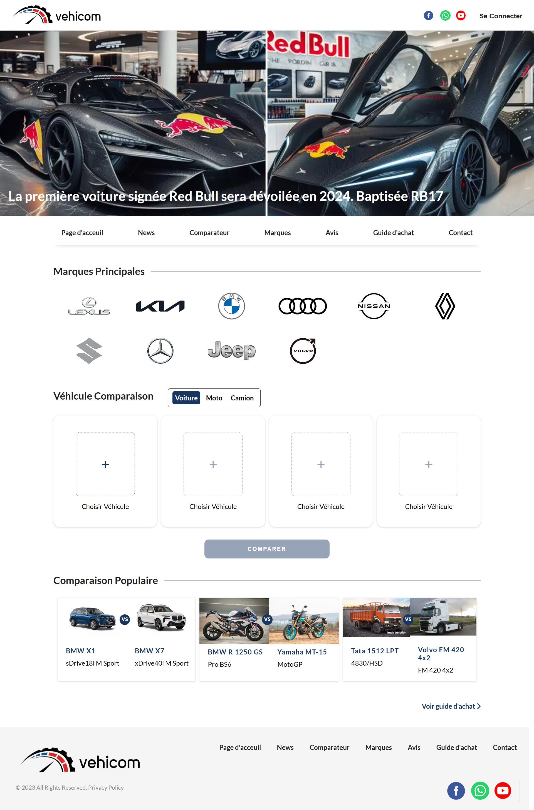
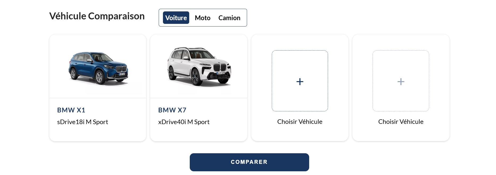
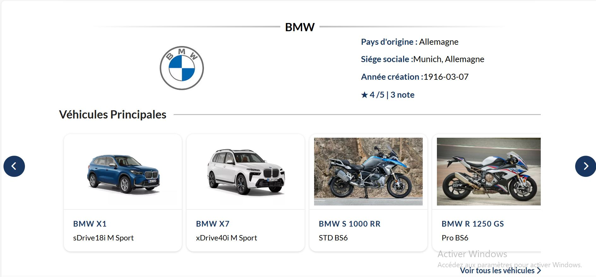
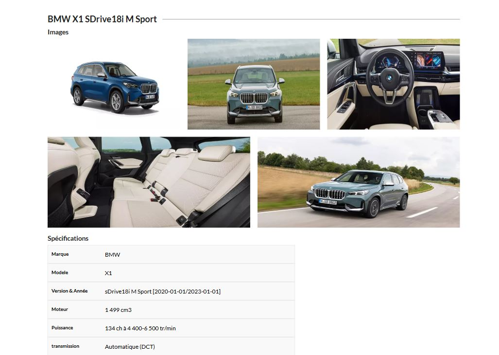
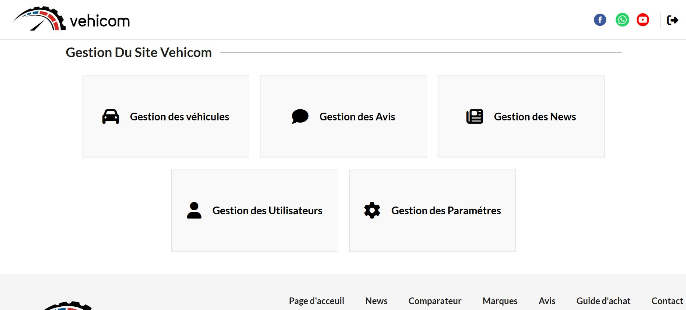

# Vehicle Comparison Web Application

Web application developed as part of the TDW (Technologies du Développement Web) module  using PHP, MySQL, HTML5, CSS3, JavaScript, jQuery, and Ajax following the MVC architecture pattern.

The platform allows users to compare different types of vehicles through a dynamic and user-friendly interface. Users can explore vehicle specifications, brands, automotive news, reviews, ratings, and favorites while interacting with the platform through authentication and profile management.

## Features

- Comparison of up to 4 vehicles
- Detailed vehicle specifications
- Brand and model exploration
- Automotive news section
- User reviews and ratings
- Favorites system
- Authentication and user profiles
- Administration dashboard for managing vehicles, users, reviews, and news


## Database

The SQL database export is available in:

```bash
database/tdw.sql
```

## Installation

1. Clone the repository

```bash
git clone https://github.com/Meriem-ht/TDW.git
```

2. Import `tdw.sql` using phpMyAdmin

3. Start Apache and MySQL using WAMP

4. Open the project in your browser

## Screenshots

### Home Page


### Vehicle Comparison


### Brand Details


### Vehicle Details



### Administration Dashboard
